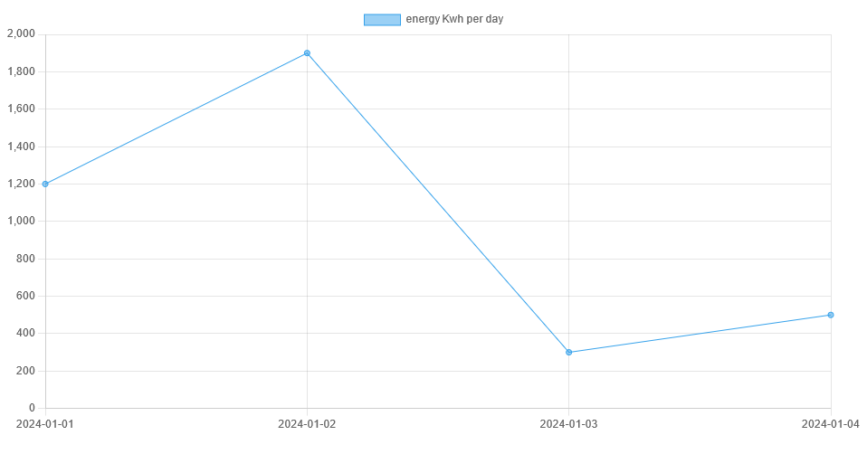

## Opzet
- maak nieuwe files aan:
    - in de directory `public/07`
    - `meterstanden.html`
    - `assets/js/meterstandApp.js`

- zorg dat je daar weer een chart in krijgt
    > zie opdracht `01chart.md`

## Chart aanpassen

- pas nu de chart aan zodat die zo wordt:
    > 

> TIPS:
> - je past aan in `meterstandApp.js`
> - je `type` van je `chart` kan je aanpassen om het uiterlijk te veranderen
> - je past je `data` en `labels` ook aan

## klaar
- commit alles naar je github