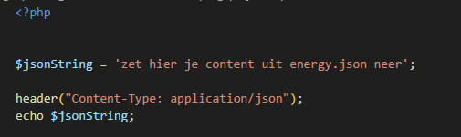

# Nu de meterstanden uit de database nog

> Nu alles werkt met het JSON-bestand kunnen we die vervangen door naar een php file te gaan, daar kunnen we dan later de database in bouwen

## Opzet
- maak nieuwe files aan:
    - `meterstandenUitPhp.html`
    - `assets/js/meterstandUitPhpApp.js`
        - in de directory `public/07`

- zet daar je code in die je in de files hieronder ziet 
    - `meterstanden.html`
    - `assets/js/meterstandApp.js`
    > *Let op!!* wijs naar de `JUISTE` javascript file niet naar `meterstandApp.js`

## Test

- test of de nieuwe files werken en je je chart op het beeld krijgt

## Json uit PHP

- maak een nieuwe php file:
    - `meterstandenUitPhp.php`
        - in de directory `public/07`

- zet daar de volgende code in:
    > 
- kijk even goed of je begrijpt waarom we die `header` call daar hebben staan

> - [PHP header() documentatie](https://www.php.net/manual/en/function.header.php) 
> - Met de `header()` function stuur je de header die aangeeft dat er JSON aan komt.

## testen

> weer even testen, elke wijziging moet je even testen dat scheelt later werk

- open je browser en ga naar `meterstandenUitPhp.php`
    > als het goed is krijg je jouw data als json te zien:
    > 

## verbinden

- open je `meterstandUitDbApp.js`
    - pas je `fetch` url aan zodat deze de `meterstandenUitPhp.php` download 

## Testen

- open `meterstandenUitPhp.html` in je browser
    - kijk met de netwerk inspector of je je php laad
    > 

## klaar
- commit alles naar je github

