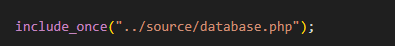

# Nu de meterstanden uit de database nog

> Nu alles werkt met het JSON-bestand kun je de meterstanden uit de database in hetzelfde JSON formaat gaan zetten. 
Je ziet daarna de ingevoerde meterstanden in je chart.

## Lezen uit de database

- maak een nieuwe file:
    - `meterstandenUitDB.php`
        - in de directory `public/07`
    - eerst `includen` we onze` database.php`:
        > 

- nu kunnen we een connection maken:
    > 
- als laatst testen we of we kunnen selecteren
    > 
    
## echte query

- de `select 1 ` vervangen we nu door:
    > 

- de `print_r` moeten we ook aanpassen
    > 

- nu moeten we van rows een json object gaan maken
    - direct naar json omzetten gaat niet helemaal aansluiten dus neem deze code over:
    > 
    
## html

- maak een nieuwe file:
    - `meterstandenDbPhp.html`
        - in de directory `public/07`
        - zet daar hetzelfde in als wat in `meterstanden.html` staat

## testen
- open je browser en ga naar `meterstandenUitDB.php`
    > als het goed is krijg je jouw data als json te zien:
    > 

- open nu `meterstandenDbPhp.html` en controlleer of alles werkt:
    > 

## screenshot
- maak een screenshot van je resultaten:
    - `uitdedatabase.png`
    - zet deze in je `screenshots` directory

    
## klaar
- commit alles naar je github

### Links

- [PHP json_encode() documentatie](https://www.php.net/manual/en/function.json-encode.php) - Met deze function zet je een array om naar JSON.

