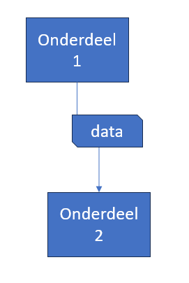

# Nu de meterstanden uit de database nog

> powerpoint is niet het programma voor design, maar voor deze opdracht is het even prima
- maak in powerpoint een schema van:
    - welke onderdelen je allemaal gemaakt hebt 
        > *( gebruik box shapes)*
    - welke onderdelen met elkaar praten 
        > *(gebruik pijlen)*
    - welke data waarheen gaat 
        - zet hier ook het hoe en wat bij
        >*(gebruik box shapes met een andere kleur)*

> voorbeeld:
> 

- maak een screenshot van je schema:
    - `schema.png`
    - zet deze in je `screenshots` directory

## klaar
- commit alles naar je github

