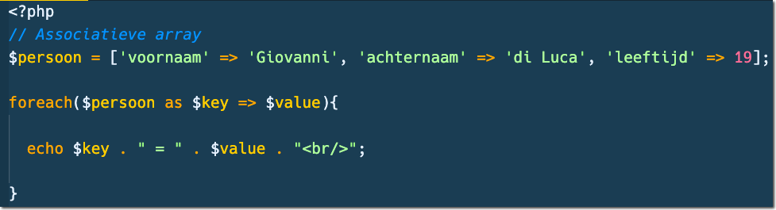
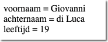
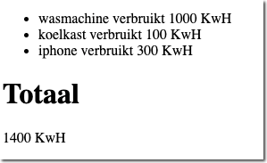

# UITLEG: Foreach loop door een array

> De elementen in een normale array kun je dus ophalen met de index (die bij 0 begint)
> In een *associatieve array* gebruik je een eigen *key* voor de *value* die er bij hoort.
> Zo kun je direct iets ophalen waarvan je de *key* al weet.
> 
> Hoe kun je door een associatieve array loop-en? Met de **foreach-loop**!
> De foreach-loop geeft je elke keer de *key* EN de *value* die bij die key hoort:

*Voorbeeld foreach-loop door associatieve array:*

*Resultaat*  

### Opdracht 1

- Maak een nieuw bestand `associatief.php` met HTML-structuur.
    - in de directory `public/03`
- Zoek op internet naar het verbruik van 5 huishoudelijke apparaten in `KwH`.
- Maak een nieuwe variabele `$verbruik` met een **associatieve array*.
- Als `key` gebruik je de naam van het apparaat,
    - de `value` is het verbruik van het apparaat 
        - zorg dat het verbruik een `integer` is en geen tekst.

- Schrijf nu een `foreach` loop die:
    - eerst de `naam` van het apparaat op het scherm zet
    - en dan het `verbruik` van het apparaat op het scherm zet.
    - Gebruik wat verschillende HTML-tags in je output 
        - en pas wat stijling met een CSS bestand toe

### Opdracht 2

- Maak nu `Na` de `foreach-loop` een variabele `$totaal` 
    - zet de waarde op 0  
- Kopieer nu de hele `foreach-loop` en zet hem onder de vorige `foreach-loop`
- Verwijder de code `IN` de `nieuwe` loop
- Tel nu `IN` de loop elke keer het verbruik van elk apparaat op bij het `$totaal`
- Gebruik echo `NA` de loop om het `totaal` (de variabele `$totaal`) op het scherm te zetten.

> Je hebt nu een foreach-loop gebruikt om al het verbruik bij elkaar op te tellen.

## klaar
- commit alles naar je github